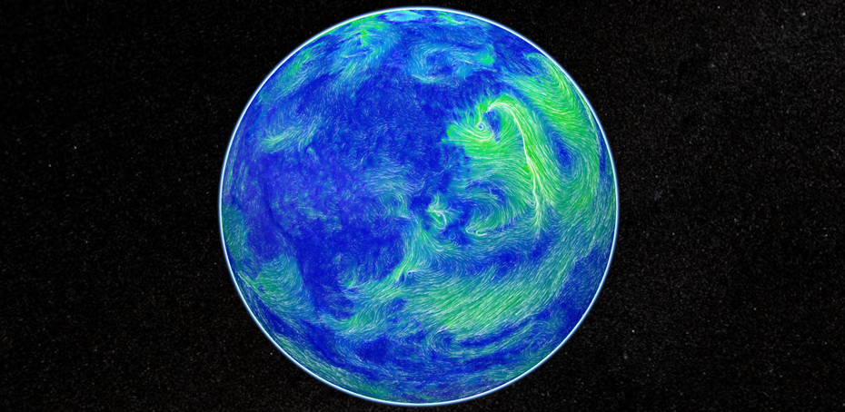
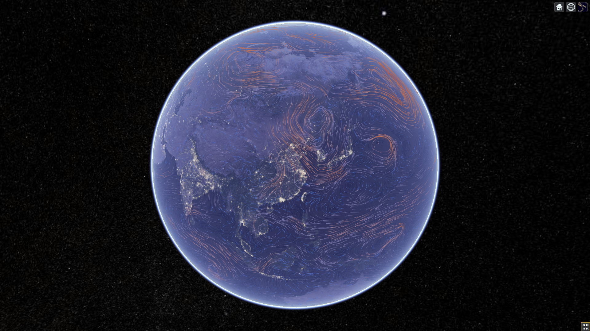
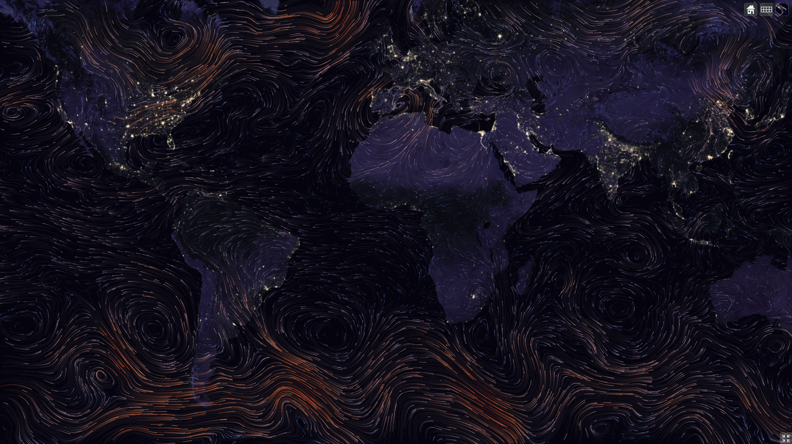

# Cesium-wind 🚀
A demo of wind on cesium globe 🌏




### 📑关于

本项目基于[https://github.com/Esri/wind-js](https://github.com/Esri/wind-js) 移植到Cesium。在二维、三维下均可正常运行。

有关风场动画的运行原理和相关算法请参考 [https://github.com/Esri/wind-js](https://github.com/Esri/wind-js) 和 [https://github.com/cambecc/earth](https://github.com/cambecc/earth) 这两个项目。

### 💻如何运行

```
git clone https://github.com/vensing/cesium-wind
```

使用 vscode 打开本项目，安装 `Live Server` 插件,选中index.html右键 Open with live server，即自动跳转到默认浏览器加载。

或者也可以放到 web 服务器中，作为静态页面加载。

### 🚥注意事项

1. 风场动画基于 canvas 实现，因此您必须在添加一层画布，画布层叠于 Cesium 地图之上，且设置  `pointer-events: none;` 禁用画布拖动事件否则无法拖拽 Cesium 地图：
    ```css
    #wind{
        position: absolute;
        top: 0;
        left: 0;
        z-index: 3;
        pointer-events: none;
    } 
    ```
2. 推拽地图时，由于清除粒子需要一些时间，导致地图拖动到其他位置后，粒子还在画布上之后才消失，因此在停止绘制粒子之前先设置画布不显示，重新绘制粒子时设置为显示。

### 📈效果图





### 📁参考项目

[https://github.com/Esri/wind-js](https://github.com/Esri/wind-js) 

[https://github.com/cambecc/earth](https://github.com/cambecc/earth) 

